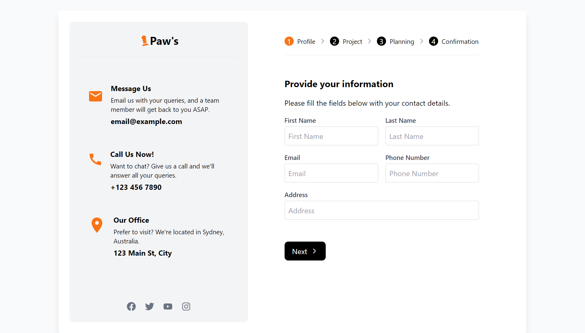

# Multi-Step Form Application

This project is a multi-step form application built with React. It uses the `react-hook-form` library for form handling and `react-icons` for integrating icons. The form guides the user through four steps: Profile, Project, Planning, and Confirmation.

## Features

- **Responsive Design**: The layout adjusts for different screen sizes using Tailwind CSS classes.
- **Multi-Step Form**: Users navigate through a four-step form process, with validation at each step.
- **React Hook Form**: Used for managing form state and validation.
- **Icon Integration**: Utilizes `react-icons` for visual enhancement.

## Icons Used

- `react-icons/fa`: Facebook, Twitter, Youtube, Instagram, Check, Dollar Sign, Chart Pie
- `react-icons/io`: Arrow Forward, Arrow Back
- `react-icons/md`: Location, Call, Email
- `react-icons/fa6`: Chess Pawn
- `react-icons/bs`: Stars
- `react-icons/vsc`: Thumbsup

### Prerequisites

- Node.js installed on your machine.
- npm (Node Package Manager) or Yarn.

